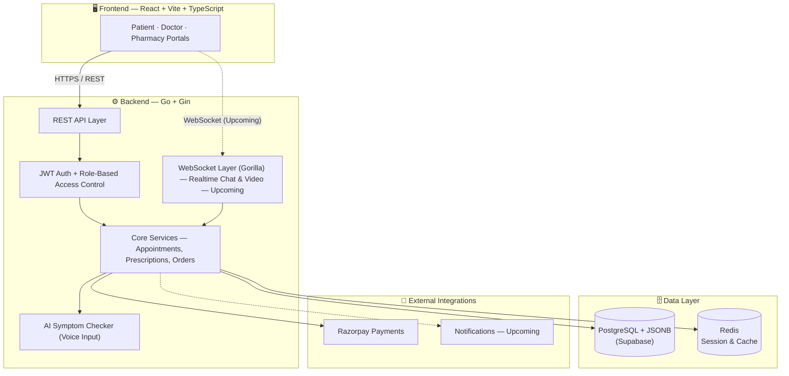

<div align="center">


<br/>

[](https://github.com/imanmay2/NexCare/stargazers)
[](https://github.com/imanmay2/NexCare/network/members)
[](https://github.com/imanmay2/NexCare/commits/main)
[](LICENSE)
[](#-roadmap)

<br/>

### 🌐 [**Live Demo**](https://nexcare.live) &nbsp;|&nbsp; 💻 [**Source Code**](https://github.com/imanmay2/NexCare) &nbsp;|&nbsp; 📧 [**Get in Touch**](mailto:imanmay2@gmail.com)

</div>

<br/>

> **NexCare is a unified digital health ecosystem** that connects **patients, doctors, and pharmacies** on a single platform — from booking a consultation to getting a digital prescription to having medicines delivered to your door. One login. One platform. Zero friction.

<br/>

<!-- 
  📌 ADD YOUR HERO SCREENSHOT / DEMO GIF HERE
  Recommended size: 1200x650, place in ./assets/demo/hero.gif or .png
-->
<div align="center">
  
  <p><i>↑ Replace this with a screen-recording GIF of the live app in action ↑</i></p>
</div>

<br/>

---

## 📋 Table of Contents

- [💡 The Problem](#-the-problem)
- [✨ The Solution](#-the-solution)
- [📸 Product Preview](#-product-preview)
- [⚡ Features](#-features)
- [🧠 Tech Stack](#-tech-stack)
- [🏗️ System Architecture](#-system-architecture)
- [📂 Project Structure](#-project-structure)
- [🚀 Getting Started](#-getting-started)
- [🔐 Environment Variables](#-environment-variables)
- [🗺️ Roadmap](#-roadmap)
- [👥 Team](#-team)
- [🤝 Contributing](#-contributing)
- [⭐ Star History](#-star-history)
- [📬 Connect](#-connect)

---

## 💡 The Problem

Healthcare access today is **broken into silos**:

| Pain Point | Reality Today |
|---|---|
| 🏥 **Fragmented Journey** | Booking a doctor, getting a prescription, and ordering medicines happen on 3 different apps (or none at all) |
| ⏳ **Time-Consuming** | Long queues, manual paperwork, and repeated history-sharing at every visit |
| 📍 **Limited Access** | Quality specialists are concentrated in cities, leaving smaller towns underserved |
| 🧾 **No Continuity** | Prescriptions and health records get lost between visits, doctors, and pharmacies |

## ✨ The Solution

**NexCare unifies the entire care loop** — consultation → prescription → medication — into a single, role-aware platform for **Patients**, **Doctors**, and **Pharmacies**.

```
  Patient books appointment  →  Doctor consults & prescribes  →  Pharmacy fulfills & delivers
            🧑‍💻                          🩺                              💊
```

We're not building "just another booking app" — we're building the **connective tissue of digital healthcare**, with AI-assisted triage, real-time communication, and a payments layer baked in from day one.

---

## 📸 Product Preview

<!-- 
  📌 ADD YOUR LIVE SCREENSHOTS / GIFS BELOW
  Suggested folder structure:
    assets/
    └── screenshots/
        ├── landing.png
        ├── patient-dashboard.png
        ├── doctor-dashboard.png
        ├── pharmacy-portal.png
        └── prescription.png
-->

<div align="center">
  
  <p><b>Landing Page</b></p>
</div>

<br/>

<table align="center">
  <tr>
    <td align="center" width="50%">
      
      <br/><b>🧑‍💻 Patient Dashboard</b>
    </td>
    <td align="center" width="50%">
      
      <br/><b>🩺 Doctor Dashboard</b>
    </td>
  </tr>
  <tr>
    <td align="center" width="50%">
      
      <br/><b>💊 Pharmacy Portal</b>
    </td>
    <td align="center" width="50%">
      
      <br/><b>🧾 Digital Prescription</b>
    </td>
  </tr>
</table>

---

## ⚡ Features

<table>
<tr>
<th width="33%">🧑‍💻 Patient</th>
<th width="33%">🩺 Doctor</th>
<th width="33%">💊 Pharmacy</th>
</tr>
<tr valign="top">
<td>

- ✅ Book doctor appointments
- ✅ Razorpay-powered payments
- ✅ Access digital prescriptions
- ✅ Order medicines from prescriptions
- ✅ AI symptom checker (voice input)
- ✅ Health metrics tracking
- 🔄 Real-time chat
- 🔜 Video & audio consultations

</td>
<td>

- ✅ Manage appointment schedule
- ✅ Conduct consultations
- ✅ Generate digital prescriptions
- ✅ View complete patient history
- ✅ Role-based secure dashboard
- 🔄 Live session via WebSockets
- 🔜 Video consultation room

</td>
<td>

- ✅ Receive prescriptions instantly
- ✅ Process medicine orders
- ✅ Manage delivery pipeline
- ✅ Role-based access control
- 🔜 Inventory sync
- 🔜 Delivery tracking

</td>
</tr>
</table>

<div align="center">

| Legend | Meaning |
|---|---|
| ✅ | Shipped & working |
| 🔄 | In active development |
| 🔜 | Planned / Upcoming |

</div>

---

## 🧠 Tech Stack

<div align="center">

### Frontend


### Backend


### Database & Infra


</div>

<br/>

| Layer | Technologies |
|---|---|
| **Frontend** | React.js, TypeScript, Vite, Tailwind CSS, Axios |
| **Backend** | Go, Gin Framework, REST APIs, WebSockets (Gorilla) |
| **Database** | PostgreSQL (Supabase), JSONB for flexible health records, Redis for caching/sessions |
| **AI / LLM** | Agentic AI pipeline for symptom checking with voice input |
| **Payments** | Razorpay API for appointment booking & checkout |
| **Cloud & DevOps** | Docker, AWS (EC2, S3), Render, Netlify, GitHub Actions (CI/CD) |

---

## 🏗️ System Architecture



---

## 📂 Project Structure

<details>
<summary><b>🔹 Backend (Go + Gin)</b></summary>

```
backend/
├── config/
│   ├── db.go
│   └── redis.go
│
├── controllers/
│   ├── doctor.go
│   ├── patient.go
│   └── users.go
│
├── middleware/
│
├── models/
│   ├── DoctorModel.go
│   ├── PatientModel.go
│   └── UserModel.go
│
├── routes/
│
├── util/
│
├── .env
├── go.mod
├── go.sum
└── main.go
```

</details>

<details>
<summary><b>🔹 Frontend (React + Vite + TypeScript)</b></summary>

```
client/
├── src/
│   ├── components/
│   ├── guidelines/
│   ├── styles/
│   ├── utils/
│   ├── App.tsx
│   └── main.tsx
│
├── index.html
├── package.json
├── vite.config.ts
└── .env
```

</details>

---

## 🚀 Getting Started

### Prerequisites


### 1️⃣ Clone the repository

```bash
git clone https://github.com/imanmay2/NexCare.git
cd NexCare
```

### 2️⃣ Backend Setup

```bash
cd backend
go mod tidy
go run main.go
```

### 3️⃣ Frontend Setup

```bash
cd client
npm install
npm run dev
```

🎉 The app should now be running locally — backend on `http://localhost:8080` and frontend on `http://localhost:5173`.

---

## 🔐 Environment Variables

**Backend `.env`**

```env
PORT=8080
DATABASE_URL=your_postgresql_url
JWT_SECRET=your_jwt_secret
REDIS_URL=your_redis_url
RAZORPAY_KEY_ID=your_razorpay_key
RAZORPAY_KEY_SECRET=your_razorpay_secret
```

**Frontend `.env`**

```env
VITE_API_BASE_URL=http://localhost:8080
VITE_RAZORPAY_KEY=your_razorpay_public_key
```

---

## 🗺️ Roadmap

- [x] Core REST APIs (Patients, Doctors, Pharmacies)
- [x] JWT authentication & role-based access control
- [x] PostgreSQL + JSONB health records
- [x] Razorpay payment integration
- [x] AI-powered symptom checker with voice input
- [ ] Redis session caching — *in progress*
- [ ] Real-time chat via WebSockets (Gorilla)
- [ ] Video & audio consultations (WebRTC)
- [ ] Notification system
- [ ] Health analytics dashboard
- [ ] Pharmacy inventory & delivery tracking

---

## 👥 Team

NexCare is built by a small, focused team combining **engineering depth** with **real-world medical insight**.

<table align="center">
<tr>
<td align="center" width="50%">
  <br/>
  <b>Manmay Chakraborty</b><br/>
  💻 Backend & System Design<br/>
  <a href="https://github.com/imanmay2">GitHub</a> · <a href="https://linkedin.com/in/imanmay2">LinkedIn</a>
</td>
<td align="center" width="50%">
  <br/>
  <b>Soumadeep</b> (MBBS)<br/>
  🩺 Medical Insights & Product Direction
</td>
</tr>
</table>

---

## 🤝 Contributing

Contributions, issues, and feature requests are welcome!

1. Fork the project
2. Create your feature branch (`git checkout -b feature/amazing-feature`)
3. Commit your changes (`git commit -m 'Add some amazing feature'`)
4. Push to the branch (`git push origin feature/amazing-feature`)
5. Open a Pull Request

---

## ⭐ Star History

<div align="center">
  <a href="https://star-history.com/#imanmay2/NexCare&Date">
    
  </a>
</div>

---

## 📬 Connect

<div align="center">

[](https://github.com/imanmay2)
[](https://linkedin.com/in/imanmay2)
[](mailto:imanmay2@gmail.com)

<br/>

### 💙 If NexCare excites you, drop a star — it really helps!


</div>
